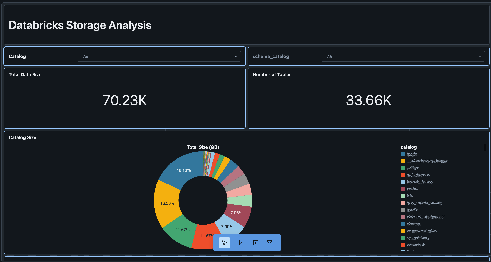
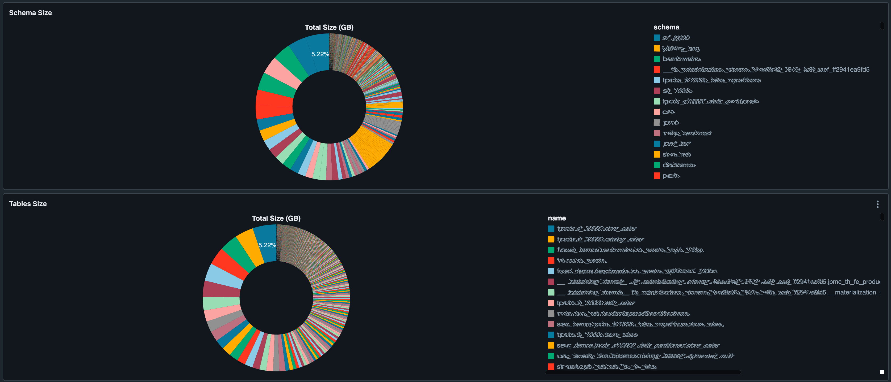
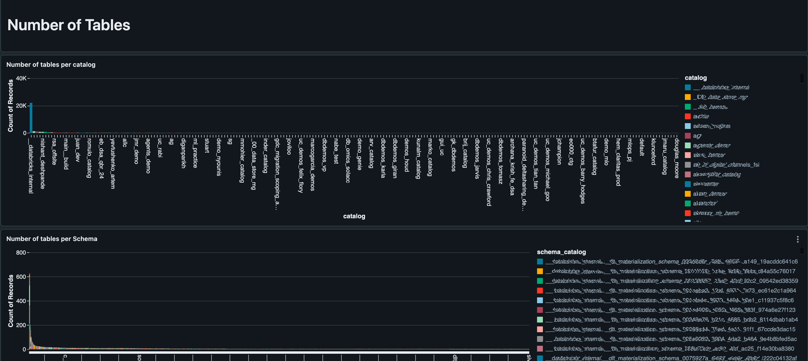
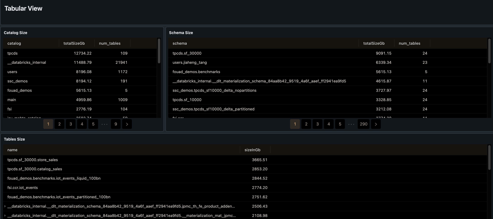
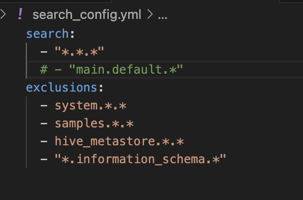

# Databricks Storage Analyzer

The 'storage_analyzer' is a tool that allows the visualization of the Databricks tables size, it includes a workflow that will scan the tables and a Dashboard to display storage size
Additionally it also contains a Dashboard to visualize UC objects inside catalogs







* The images have been anonymized


## How to configure scanning 

Go to src/search_config.yaml and configure the search scope the syntax is similar to unix file system listing and allow to use '*' to include every object at certain level,
you can also configure exclusions there are tables, schemas or catalogs you do not want to scan eg: 


## How to change the destionation schema where the tables will be created 
Go to resources/storage_analyzer.job.yml and change the parameter below:


## Steps to install and scan workspace

1. Install the Databricks CLI from https://docs.databricks.com/dev-tools/cli/databricks-cli.html

2. Authenticate to your Databricks workspace, if you have not done so already:
    ```
    $ databricks configure
    ```

3. To deploy a development copy of this project, type:
    ```
    $ databricks bundle deploy --target dev
    ```
    (Note that "dev" is the default target, so the `--target` parameter
    is optional here.)

    This deploys everything that's defined for this project.
    For example, the default template would deploy a job called
    `[dev yourname] storage_analyzer_job` to your workspace.
    You can find that job by opening your workpace and clicking on **Workflows**.

4. Similarly, to deploy a production copy, type:
   ```
   $ databricks bundle deploy --target prod
   ```

   Note that the default job from the template has a schedule that runs every day
   (defined in resources/storage_analyzer.job.yml). The schedule
   is paused when deploying in development mode (see
   https://docs.databricks.com/dev-tools/bundles/deployment-modes.html).

5. To run a job or pipeline, use the "run" command:
   ```
   $ databricks bundle run
   ```

6. Optionally, install developer tools such as the Databricks extension for Visual Studio Code from
   https://docs.databricks.com/dev-tools/vscode-ext.html.

7. For documentation on the Databricks asset bundles format used
   for this project, and for CI/CD configuration, see
   https://docs.databricks.com/dev-tools/bundles/index.html.


   License: Free to use, support is not provided (best effort) please submit a github issue
